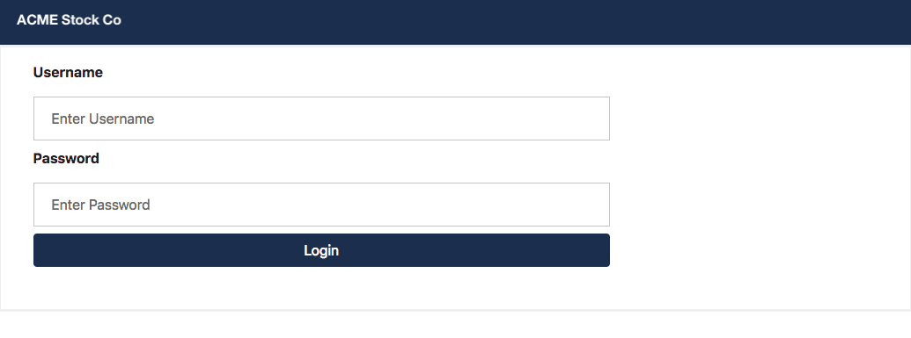
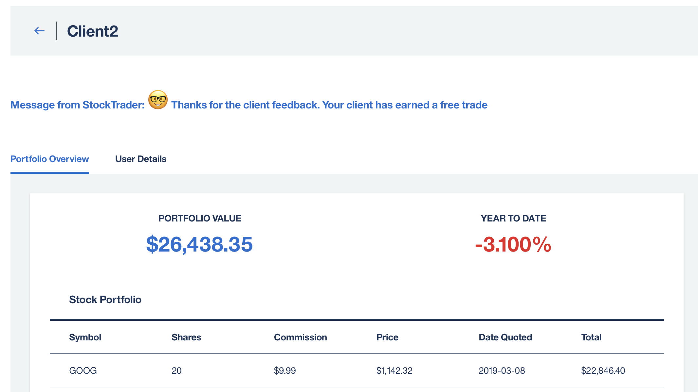

# IBM Client Developer Advocacy App Modernization Series

## Lab - Deploying Microservices

### Deploying and testing the IBM StockTrader sample application in  Kubernetes


## Overview

In this lab you will deploy and test the *IBM Stock Trader application* in the IBM Cloud Kubernetes Service.

The *IBM Stock Trader*  application is a simple stock trading sample, where you can create various stock portfolios and add shares of stock to each for a commission. It keeps track of each porfolio’s total value and its loyalty level, which affect the commission charged per transaction. It also lets you submit feedback on the application, which can result in earning free (zero commission) trades, based on the tone of the feedback. (Tone is determined by calling the Watson Tone Analyzer).

The architecture of the  app is shown below:


The **portfolio** microservice sits at the center of the application. This microservice;
* persists portfolios using JDBC to a MariaDB database
* invokes the **stock-quote** service that invokes an API defined in API Connect in the public IBM Cloud to get stock quotes
* invokes the Tone Analyzer service in the public IBM Cloud to analyze the tone of submitted feedback
* sends trades to Kafka so that they can be recorded in Mongo by the **trade-history** microservice

**Tradr** is a Node.js UI for the porfolio service

The **event-consumer** service serves as a Kafka consumer and uses APIs exposed by the **trade-history** service to send received  data to that service.

The **trade-history** service is called by the **event-consumer** and records trade records sent to Kafka by the **portfolio** service in a Mongo database. This service also exposes an API - [ ] o query the historical data.

The **stock-quote** service queries an external service to get real time stock quotes via an API Connect proxy.

## Setup

1. If following this lab as part of an IBM instructor led workshop, please follow these instructions to setup your workshop environment: [https://gist.github.com/jzaccone/0cdc321e5dc8adb0dca98ca861284c01](https://gist.github.com/jzaccone/0cdc321e5dc8adb0dca98ca861284c01)

2. Initialize Helm client
```
   helm init --client-only
```   


###  Step 1: Prepare for installation

Like a typical  Kubernetes app, Stock Trader use secrets and ConfigMaps to store information needed by one  or more microservices to access external  services and other microservices. We've  provided that info in a file hosted in Cloud Storage and there is a script that you'll use to retrieve it.


1. From a terminal window clone the Github repo that has everything needed to deploy the aggregated Stock Trader app.
```
   git clone https://github.com/IBMStockTraderLite/stocktrader.git
   cd stocktrader

```

2. Retrieve credentials and other details needed to create secrets and/or ConfigMaps
```bash
   # Note you must be in the scripts sub folder or this command will fail
   cd scripts   
   # Your instructor will provide the URL
   ./setupLab.sh [URL of external storage]
```

3. Verify that the output looks something like the following:
```
  Script being run from correct folder
  Using user01-cluster as IKS cluster name ...
  Getting Ingress subdomain for cluster user01-cluster  ...
  Updating Helm chart with ingress subdomain : user01-cluster.us-east.containers.appdomain.cloud
  Setup completed successfully
```

4. Also verify that there is now a file called **variables.sh** in the current folder

###  Step 2: Install all the prereq

In this part  you'll install the prereqs step by step before installing the Stock Trader application.

1. Install MariaDB by running the following command. Verify that no errors are displayed by the installation script.
```
   ./setupMariaDB.sh

```

2. Install Mongo by running the following command. Verify that no errors are displayed by the installation script.
```
   ./setupMongo.sh

```

3. Create the DNS Proxy and store all the  access information as secrets  for the  external Kafka installation. Verify that no errors are displayed by the script.
```
   ./setupKafka.sh

```

4. Store all the  access information as secrets for the API Connect proxy to the external  realtime stock quote . Verify that no errors are displayed by the script.
```
   ./setupAPIConnect.sh

```

5. Store all the  access information as secrets for the  external  Watson Tone Analyzer service . Verify that no errors are displayed by the script.
```
   ./setupWatson.sh

```
6. Verify your progress so far. Run the following to see the pods you have so far
```
   kubectl get pods
```
...The output should show pods for MariaDB and Mongo and they both should be running and in the READT state

```
   NAME                                        READY     STATUS    RESTARTS   AGE
   stocktrader-db-mariadb-0                    1/1       Running   0          15m
   stocktrader-hist-mongodb-6567c75556-cxgcn   1/1       Running   0          4m
```
7. Next look at your services
```
   kubectl get svc
```
8. Verify that the output shows services for Mongo, MariaDB and your DNS proxy to Kafka
```
NAME                                 TYPE           CLUSTER-IP      EXTERNAL-IP                                               PORT(S)     AGE
stocktrader-db-mariadb               ClusterIP      172.21.251.2    <none>                                                    3306/TCP    21m
stocktrader-hist-mongodb             ClusterIP      172.21.119.68   <none>                                                    27017/TCP   9m
stocktrader-pubsub-kafka-dns-proxy   ExternalName   <none>          kafka01-prod02.messagehub.services.us-south.bluemix.net   <none>      8m
```
###  Step 3: Install the StockTrader app

In this part  you'll install all the Stock Trader microservices using a Helm chart that has templates for all the microservices. Note that all the  microservices require some of the information stored via secrets in the scripts you ran in the previous section.


1. Go back to the top level folder of the  cloned repo
```
  cd ..
```

2. Install the Helm chart. Verify that no errors are displayed
```
   helm install --name stocktrader stocktrader
```

3. Verify that all the pods are running and are in the READY state. Note you may have to run this command multiple times before all the pods become READY.
```
  kubectl get pods
```
4. Keep running the command  until the output looks something like this:
```
NAME                                        READY     STATUS    RESTARTS   AGE
event-streams-consumer-747cb6b969-xjb6f     1/1       Running   0          1m
portfolio-5795476c5f-jdg86                  1/1       Running   0          1m
stock-quote-f489dc6f9-8kglr                 1/1       Running   0          1m
stocktrader-db-mariadb-0                    1/1       Running   0          38m
stocktrader-hist-mongodb-6567c75556-cxgcn   1/1       Running   0          27m
trade-history-6598fd5b7f-pkhvf              1/1       Running   0          1m
tradr-558f6b84b5-82pj8                      1/1       Running   0          1m
```

5. The app uses Ingress to provide access outside of the Kubernetes cluster. Use the following command to get the external hostname you'll need to access Stock Trader.
```
   kubectl get ingress
```
6. Verify the output looks something like the following. The value in the  HOSTS column is the hostname part of the URL that you'll use to access the microservices that have an external interface.
```
NAME                  HOSTS                                               ADDRESS          PORTS     AGE
stocktrader-ingress   user01-cluster.us-east.containers.appdomain.cloud   169.61.102.110   80        15m
```

## Step 4: Test the app

In this part you'll verify that the various microservices are working as designed.

1. Bring up the web application using the Ingress hostname you noted at the end of the  previous  section and appending the path ``/tradr`` to it. So for example if your Ingress hostname is ``user49-cluster.us-east.containers.appdomain.cloud`` then the URL will be ``http://user49-cluster.us-east.containers.appdomain.cloud/tradr``



2. Log in with the following credentials (note these are the only values that will work)
```
   username:  stock
   password: trader
```


3. Click **Add Client** and name the client ``Client2``. Click **OK**


4. Click on the link in the **Name** column to see the  details of Client2

5. Do 3 or 4 "Buy" operations with different stock tickers (e.g. STT, T, GOOG, IBM).


6. Sell part of one of the holdings you just bought and verify that the table is updated appropriately

7. Click on **Feedback** and submit some client feedback. If the client sounds really angry they'll get 3 free trades otherwise they'll get one free trade.



8. Verify that the data flow of ``portfolio->Kafka->event-consumer->trade-history-Mongo`` works by querying the **trade-history*** service via an endpoint  that makes it do a Mongo query.  Add the path ``/trade-history/trades/Client2`` to the Ingress hostname. For example ``http://user49-cluster.us-east.containers.appdomain.cloud/trade-history/trades/Client2`` for an Ingress hostname that starts with ``user49``.

9. Enter the URL in another browser tab and verify that the history has captured  all the  trades you did while testing. A partial screen shot of what you should get back is shown below:


## Cleanup

Free up resources for subsequent labs by deleting the Stock Trader app.

1. Run the following commands to cleanup (note: you can copy all the commands at once and post then into you command window)
```
   cd scripts
   helm delete --purge stocktrader
   ./cleanupWatson.sh
   ./cleanupAPIConnect.sh
   ./cleanupKafka.sh
   ./cleanupMongo.sh
   ./cleanupMariaDB.sh
   cd -
```


## Summary
You installed and then tested the  Stock Trader microservoces sample application and got some insight into the challenges of deploying microservices apps in a Kubernetes cluster.
